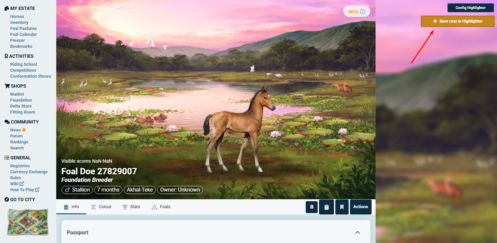
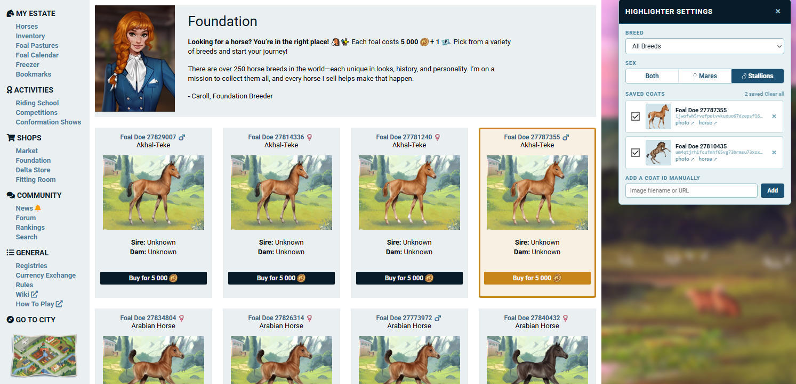

# Horse Reality Highlighter

> Horse Reality Highlighter ☆ es una extensión de Chrome hecha por **claymore**
>
> 🌐 [English](README.md) · **Español**

Esta extensión de Chrome te ayuda a encontrar caballos concretos en **Horse Reality**, resaltándolos en la página de la Fundación según su **raza**, **capa** y **sexo**.

## Funciones

-   **Guardar capas desde el perfil de un caballo.** Un botón **"Save coat to Highlighter"** en el perfil del caballo captura la **capa de potro** (la imagen que utiliza la Fundación), para que puedas buscar potros que coincidan.
    -   Funciona con caballos adultos (extrae) la imagen de potro de la pestaña **Colour**, potros mostrados junto a su madre y potros solos.
    
-   **Lista de capas gestionada.** Cada capa guardada aparece en el panel de ajustes con una **miniatura**, un **enlace a la foto** y un **enlace al caballo de origen**. Cada capa tiene un interruptor para **activarla/desactivarla**, así puedes encender o apagar el resaltado sin perderla.
-   **Filtro por sexo.** Resalta solo **yeguas**, solo **sementales** o **ambos**.
-   **Filtro por raza.** Elige una raza concreta o busca en "All Breeds" (todas las razas).
-   Los caballos que coinciden se resaltan con un **borde dorado** y fondo dorado, el botón "Buy" (comprar) también se vuelve dorado.
-   El estilo combina con la extensión **HR color predictor** (la paleta de colores oficial de Horse Reality).

    

## Juego limpio y seguridad

-   Toda la lógica se ejecuta localmente en tu navegador. No se envía ningún dato a ningún servidor externo.
-   Esta herramienta **no** tiene autoclickers, compradores automáticos ni ningún tipo de bot. No interactúa con el servidor del juego.
-   Simplemente modifica el CSS (los estilos) de la página para resaltar las imágenes concretas que buscas. Aún tienes que revisar y comprar el caballo manualmente.

Esto entra dentro del tipo de herramienta descrita en la [Regla 7: Writing Scripts](https://v2.horsereality.com/rules#7) de Horse Reality, que permite programas que extraen datos públicamente disponibles de Horse Reality a una hoja de cálculo o base de datos externa, o que solo modifican la interfaz de usuario.

(*"Programs that scrape publicly available Horse Reality data to an external spreadsheet or database, or that only modify the user interface."*)

Esta extensión solo modifica la interfaz de usuario: resalta y aplica estilos a elementos que ya están en la página.

Esto no significa que la extensión tenga soporte oficial por parte de Horse Reality. Según la misma regla, los programas de terceros son responsabilidad exclusiva de quienes los desarrollan. Horse Reality no se hace responsable del mantenimiento, integridad ni continuidad de esta extensión. Cualquier bug o petición de funcionalidad debe enviarse directamente al desarrollador, no al soporte de HR.

## Cómo instalar

1.  **Descarga** el código fuente de esta extensión en una carpeta de tu ordenador.
2.  Abre Google Chrome y ve a `chrome://extensions/`.
3.  En la esquina superior derecha, activa el **Modo de desarrollador** (Developer mode).
4.  Pulsa el botón **Cargar descomprimida** (Load unpacked) que aparece arriba a la izquierda.
5.  Selecciona la carpeta donde guardaste los archivos de la extensión (la que contiene `manifest.json`).
6.  ¡La extensión ya está instalada!

## Cómo usar

### Guardar capas desde el perfil de un caballo

1.  Abre la página de perfil de cualquier caballo (`/horses/...`).
2.  Pulsa **"Save coat to Highlighter"**.
3.  Aparece una confirmación con una miniatura de la **capa de potro** capturada. Ya está en tu lista (activada por defecto).
    *   *Nota*: En los caballos adultos, la imagen de potro está en la pestaña **Colour**. El botón abre esa pestaña automáticamente si aún no está cargada; si alguna vez ves "Coat not found" (capa no encontrada), abre la pestaña Colour una vez y vuelve a pulsar.

### Resaltar en la Fundación

1.  Ve a la página Foundation de Horse Reality.
2.  Pulsa el botón **"Config Highlighter"** fijo en la **esquina superior derecha** de la pantalla para abrir el panel de ajustes.
3.  **Breed** (raza): elige una raza o déjalo en "All Breeds".
4.  **Sex** (sexo): elige **Both** (ambos), **Mares** (yeguas) o **Stallions** (sementales).
5.  **Saved Coats** (capas guardadas): cada capa guardada aparece con una miniatura y enlaces. Usa la **casilla** de cada fila para activarla/desactivarla, o la **×** para eliminarla.
    *   También puedes pegar el nombre de archivo o la URL de una imagen en **"Add a coat ID manually"** y pulsar **Add**.
6.  El resaltado se actualiza al instante, sin necesidad de un botón de guardar. Un caballo se resalta solo cuando coincide con los filtros de raza **y** sexo **y** al menos una capa activada.

## Cómo actualizar

1.  Reemplaza los archivos antiguos de tu carpeta por las versiones nuevas.
2.  Vuelve a `chrome://extensions/`.
3.  Busca la tarjeta "Horse Reality Highlighter" y pulsa el **icono de Recargar/Refrescar** (la flecha circular).
4.  **Refresca** la página de Horse Reality para ver los cambios.

## Compatibilidad de navegadores

Esta extensión está construida sobre el motor **Chromium** y funciona en:

-   **Google Chrome**
-   **Microsoft Edge**
-   **Opera** y **Opera GX**
-   **Brave**
-   **Vivaldi**
-   **Chromium**

*Nota: Firefox no es compatible actualmente sin modificaciones.*
