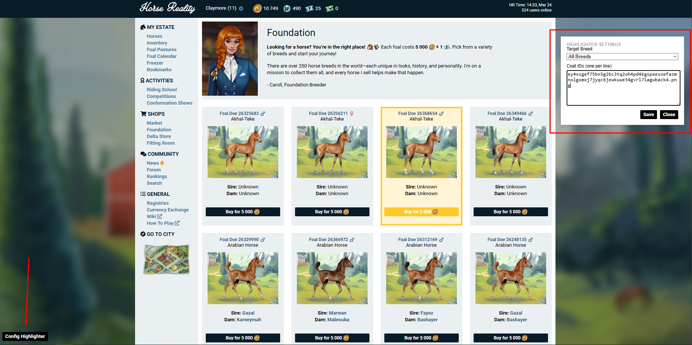

# Horse Reality Highlighter by claymore

This Chrome extension helps you find specific horses on **Horse Reality** by highlighting them based on their Breed and Coat Image ID.

## Features

-   Horses matching your criteria are highlighted with a **gold border** and a **gold background**. The "Buy" button also turns gold.
-   A configuration menu allows you to set your target Breed and a list of Coat IDs.
-   Select a specific breed or search across "All Breeds".
-   Input multiple image IDs (filenames) to look for specific coats.

## Fairness and Safe Play

-   All logic runs locally on your browser. No data is sent to any external server.
-   This tool does **not** have autoclickers, auto-buyers, or any form of botting. It does not interact with the game server.
-   It simply modifies the CSS (styles) of the page to highlight specific images you are looking for. You still need to manually check and purchase the horse.

## How to Install

1.  **Download** the source code for this extension to a folder on your computer.
2.  Open Google Chrome and navigate to `chrome://extensions/`.
3.  In the top right corner, toggle **Developer mode** to **ON**.
4.  Click the **Load unpacked** button that appears in the top left.
5.  Select the folder where you saved the extension files (the folder containing `manifest.json`).
6.  The extension is now installed!

## How to Use

1.  Go to the Horse Reality Foundation page.
2.  Look for the **"Config Highlighter"** button fixed in the **bottom-left corner** of your screen.
3.  Click it to open the settings window.
4.  **Target Breed**: Select the breed you are looking for from the dropdown, or leave it as "All Breeds".
5.  **Coat IDs**: Paste the image filenames of the coats you want to find.
    *   *Note*: These are usually the long filenames of the horse images (e.g., for this picture `https://horse-img.horsereality.com/large/uevdn355dvfxvhjewc7elojtmkqmhrpjk5jeojtzrgux6vf243twryhm5ssstpj4hsj3sh52z6goy.png` it would be `uevdn355dvfxvhjewc7elojtmkqmhrpjk5jeojtzrgux6vf243twryhm5ssstpj4hsj3sh52z6goy.png`).
    *   Put **one ID per line**.
6.  Click **Save**.
7.  The page will instantly update to highlight any matching horses.

## How to Update

1.  Replace the old files in your folder with the new versions.
2.  Go back to `chrome://extensions/`.
3.  Find the "Horse Reality Highlighter" card and click the **Refresh/Reload icon** (circular arrow).
4.  **Refresh** the Horse Reality webpage to see the changes.

## Browser Compatibility

This extension is built on the **Chromium** engine and works on:

-   **Google Chrome**
-   **Microsoft Edge**
-   **Opera** & **Opera GX**
-   **Brave**
-   **Vivaldi**
-   **Chromium**

*Note: Firefox is not currently supported without modifications.*

